# Parallel Issues

Run this skill from Bash. Every Bash block below is self-contained: shell state does not
persist between tool calls, so each block re-derives the repository, owner, and base branch
it needs rather than relying on variables set by an earlier block.

Run multiple independent GitHub issues simultaneously: detect Project (v2) membership, validate against ADRs and closed PRs, analyze conflicts, brainstorm each issue with the user (or skip brainstorm for autonomous handoff via `--no-brainstorm`), create isolated worktrees, dispatch **one Codex issue lead per worktree** with the same ultracode design-first gates as Claude's Workflow harness, then drive parallel **draft-phase** loops (CI, conflicts, then ONE end-of-draft adversarial cross-review) on each PR. PRs stay drafts until the USER marks them ready AND manually triggers any CodeRabbit review — automatic and incremental reviews are disabled, so nothing runs on the flip or on pushes. Never post `@coderabbitai review`/`full review`.

**Announce at start:** "I'm using the parallel-issues skill to set up parallel workstreams."

**Review providers & human feedback:** the follow-up loops handle both CodeRabbit and `github-code-quality[bot]` per `review-remote-pr`'s provider rules — never issue a manual command to either bot. For a Code Quality finding: reply to the original comment, implement the suggested fix verbatim, and let the next scan auto-clear it; if inaccurate, reply with a concrete reason and use GitHub's Dismiss finding action (the public Code Quality REST API is read-only for findings — don't invent a `gh` mutation). Human-authored reviews and comments use `review-remote-pr`'s confirmation gate: surface each item with its exact proposed handling, act and reply only after explicit per-item approval, and never resolve the human's thread. Feedback authored by the authenticated `gh` login is human too — login equality is not agent ownership.

## Process

```dot
digraph process {
    rankdir=LR;
    "Environment preflight\n(agent-preflight.sh)" -> "Detect repo\n+ fetch issues";
    "Detect repo\n+ fetch issues" -> "Project awareness\n(gh project)";
    "Project awareness\n(gh project)" -> "Prior-art check\n(ADRs + closed PRs)";
    "Prior-art check\n(ADRs + closed PRs)" -> "Conflict analysis\n(agent reasoning)";
    "Conflict analysis\n(agent reasoning)" -> "User approves\nissue set";
    "User approves\nissue set" -> "Sequential brainstorm\n(one issue at a time)";
    "User approves\nissue set" -> "Create worktrees\n(sequential)" [label="--no-brainstorm"];
    "Sequential brainstorm\n(one issue at a time)" -> "Create worktrees\n(sequential)";
    "Create worktrees\n(sequential)" -> "Dispatch issue leads\n(up to available slots)";
    "Dispatch issue leads\n(up to available slots)" -> "Collect results\n(PR URL or BLOCKED)";
    "Collect results\n(PR URL or BLOCKED)" -> "Dispatch N draft-phase\nreview-remote-pr agents (parallel)";
    "Dispatch N draft-phase\nreview-remote-pr agents (parallel)" -> "Report: drafts ready\nUSER marks ready + triggers review";
    "Report: drafts ready\nUSER marks ready + triggers review" -> "Reviews land\n-> continue fix/reply/resolve";
    "Reviews land\n-> continue fix/reply/resolve" -> "Surface human reviews\n-> user confirms each response";
    "Surface human reviews\n-> user confirms each response" -> "Print PR table\n+ worktree handoff (no cleanup)";
}
```



## Phase 1: Sequential Setup (Orchestrator)

### Step 0: Environment preflight (MANDATORY — run once, before anything else)

Run `agent-preflight.sh` once, in the repository you are about to work in, before any other command in this skill. Its twelve-line stdout block is **the environment contract for the whole run**: repo slug, branch, base, whether the repository declared its own facts in `.agent/config.env`, git writability, `gh` auth + scopes, sandbox state, CA bundle, cache directories, repo command runner, and adversarial-reviewer availability. Establish these facts once, here — never re-probe them later, and never let a dispatched agent discover them by failing.

```bash
set -euo pipefail

if ! repository_root="$(git rev-parse --show-toplevel 2>/dev/null)" || [[ -z $repository_root ]]; then
    printf '%s\n' 'Run this skill from a Git repository.' >&2
    exit 1
fi
# Locate the skill tree. Packaging MOVES it: standalone it sits at
# $CODEX_HOME/skills, but installed as a plugin it sits under
# $CODEX_HOME/plugins/cache/<marketplace>/agentkit/<version>/skills.
# `find` matches the pattern itself rather than letting the shell glob: an
# unmatched glob is a fatal error in zsh, and agent CLIs dispatch shell
# commands through the login shell, which is zsh on many machines.
agentkit=$(find "${CODEX_HOME:-$HOME/.codex}/plugins/cache" "${CLAUDE_CONFIG_DIR:-$HOME/.claude}/plugins/cache" -maxdepth 4 -type d \
    -path '*/agentkit/*/skills' 2>/dev/null | sort | tail -1)
[ -n "$agentkit" ] || agentkit="${CODEX_HOME:-$HOME/.codex}/skills"
preflight="$agentkit/.shared/scripts/agent-preflight.sh"
if [[ ! -x $preflight ]]; then
    printf 'agent-preflight.sh is missing or not executable: %s\n' "$preflight" >&2
    exit 1
fi
exclude_path="$(git rev-parse --git-path info/exclude)"
# `.agent/*`, never `.agent/`. Excluding the DIRECTORY stops git descending into
# it, which silently defeats the allowlist bootstrap-repo.sh writes into
# .gitignore -- the `!.agent/config.env` negation is then never reached, and
# committing the contract fails with a message naming only ".agent".
if ! grep -Fxq '.agent/*' "$exclude_path" 2>/dev/null; then
    printf '%s\n' '.agent/*' >> "$exclude_path"
fi
environment_contract="$("$preflight" --worktree "$repository_root" 2>/dev/null)"
printf '%s\n' "$environment_contract"
```

`agent-preflight.sh` **reports, it never blocks**: it exits 0 even when `gh` is absent, unauthenticated, or the forge is unreachable — the condition comes back as a value inside the block. Exit 2 means you passed bad arguments, nothing else. Diagnostics go to stderr, so the `2>/dev/null` above captures exactly the twelve lines; the same bytes are also written to `<worktree>/.agent/env-contract.txt`, which is why `.agent/*` goes into `.git/info/exclude` (local-only, no repo change) before the probe runs. The `/*` is load-bearing: `.agent/` would exclude the directory itself, and git does not descend into an excluded directory, so the `!.agent/config.env` allowlist in `.gitignore` would never be reached. Re-running it is safe and idempotent.

**Read these lines now — they change what you do next:**

| Line | What to do with it |
|---|---|
| `repo=` / `base=` | Answers Step 1's questions locally, with no forge round trip (`base=` carries a `source=` token — read the leading token). Reuse these values in your reasoning; the Bash blocks below re-derive them only because each block is self-contained. `repo=none` or `base=none` is the one case where Step 1 is doing real work. |
| `gh= … project-scope=no` | Board moves cannot work. Run `gh auth refresh -s project` now instead of discovering it through a failed move. |
| `git= … writable=no` | The first write needs elevated filesystem permission — the same condition `worktree-commit.sh` reports as exit 2. |
| `caches=` / `tls=` | `agent-run.sh` exports exactly these values. Nobody exports them by hand, ever. |
| `runners= repo-runner=` | When set, `agent-run.sh` delegates to it automatically. Never invoke the repo runner directly. |
| `peer-cli= <name> absent` | Skip the Claude adversarial-reviewer probe entirely; the draft-phase loop takes the blind `gpt-5.6-terra` (`xhigh`) fallback defined by `review-remote-pr` Step 1b. Presence is a `command -v` check only (`probe=not-run`) — it is not proof the binary can execute here. |

**This block is dispatch input, not a note to yourself.** Every agent this skill spawns runs with `fork_context: false` and inherits none of your context, so the contract must be pasted **verbatim** into every worker prompt (Phase 2 and Phase 3). Step 5 re-runs the probe inside each new worktree so the pasted copy's `worktree=` and `branch=` name that worker's own checkout.

### Step 1: Establish repo facts

```bash
set -euo pipefail

if ! repository_root="$(git rev-parse --show-toplevel 2>/dev/null)" || [[ -z $repository_root ]]; then
    printf '%s\n' 'Run this skill from a Git repository.' >&2
    exit 1
fi

# A repository that declares its own facts in .agent/config.env supplies them
# here; anything it omits falls through to the live discovery below. Report a
# missing resolver rather than swallowing it: silently skipping the config means
# silently paying for every discovery call it would have saved.
# Locate the skill tree. Packaging MOVES it: standalone it sits at
# $CODEX_HOME/skills, but installed as a plugin it sits under
# $CODEX_HOME/plugins/cache/<marketplace>/agentkit/<version>/skills.
# `find` matches the pattern itself rather than letting the shell glob: an
# unmatched glob is a fatal error in zsh, and agent CLIs dispatch shell
# commands through the login shell, which is zsh on many machines.
agentkit=$(find "${CODEX_HOME:-$HOME/.codex}/plugins/cache" "${CLAUDE_CONFIG_DIR:-$HOME/.claude}/plugins/cache" -maxdepth 4 -type d \
    -path '*/agentkit/*/skills' 2>/dev/null | sort | tail -1)
[ -n "$agentkit" ] || agentkit="${CODEX_HOME:-$HOME/.codex}/skills"
resolver="$agentkit/.shared/scripts/repo-config.sh"
if [[ -x $resolver ]]; then
    eval "$("$resolver" --export)"
else
    printf 'repo-config.sh not found at %s; using live discovery\n' "$resolver" >&2
fi

repository=${AGENT_REPO_SLUG:-}
if [[ -z $repository ]]; then
    if ! repository="$(gh repo view --json nameWithOwner -q .nameWithOwner 2>/dev/null)" ||
        [[ -z $repository ]]; then
        printf '%s\n' 'A GitHub origin and authenticated gh session are required.' >&2
        exit 1
    fi
fi

base=${AGENT_BASE_BRANCH:-}
if [[ -z $base ]]; then
    if ! base="$(git remote show origin | sed -n 's/^.*HEAD branch:[[:space:]]*//p' | head -n 1)" ||
        [[ -z $base ]]; then
        printf '%s\n' 'Could not determine the origin HEAD branch.' >&2
        exit 1
    fi
fi

IFS=/ read -r owner repository_name <<< "$repository"
printf 'repository_root=%s\nrepository=%s\nowner=%s\nrepository_name=%s\nbase=%s\n' \
    "$repository_root" "$repository" "$owner" "$repository_name" "$base"
```

The Step 0 preflight already reported whether a config exists on its `config=`
line. If it says `present=no`, everything below still works — the skill simply
pays for discovery it could have read from a file.

### Step 2: Triage the candidate set (MANDATORY — one call, never a loop)

One GraphQL request returns every candidate's title, labels, board membership,
Status, and cross-referenced pull requests, and caches the project-item IDs that
make later board moves single-call.

```bash
set -euo pipefail

# Locate the skill tree. Packaging MOVES it: standalone it sits at
# $CODEX_HOME/skills, but installed as a plugin it sits under
# $CODEX_HOME/plugins/cache/<marketplace>/agentkit/<version>/skills.
# `find` matches the pattern itself rather than letting the shell glob: an
# unmatched glob is a fatal error in zsh, and agent CLIs dispatch shell
# commands through the login shell, which is zsh on many machines.
agentkit=$(find "${CODEX_HOME:-$HOME/.codex}/plugins/cache" "${CLAUDE_CONFIG_DIR:-$HOME/.claude}/plugins/cache" -maxdepth 4 -type d \
    -path '*/agentkit/*/skills' 2>/dev/null | sort | tail -1)
[ -n "$agentkit" ] || agentkit="${CODEX_HOME:-$HOME/.codex}/skills"

# Auto mode: the open backlog, most recently updated first.
"$agentkit/.shared/scripts/triage-issues.sh" --limit 30

# Explicit mode (/parallel-issues 57 54) — still ONE call, via aliased sub-queries.
# "$agentkit/.shared/scripts/triage-issues.sh" --issues 57,54
```

Each line reads `#N  <status>  <verdict>  adr=<paths|->  pr=<ref|->`:

```
triage= repo=OWNER/REPO issues=7 calls=1 items-cached=5

#62    Backlog       in-flight   adr=-                     pr=#231 open
#57    Ready         clean       adr=docs/adr/0012-....md  pr=-
#54    Ready         merged-ref  adr=-                     pr=#212 merged 2026-07-30
#48    In progress   active      adr=-                     pr=-
#41    Ready         attempted   adr=-                     pr=#198 closed-unmerged
#39    -             clean       adr=-                     pr=-
```

**The verdicts are evidence, not conclusions.** The script proves that a pull
request references an issue; it cannot prove that pull request covered the whole
ask, and it does not judge ADRs. Issues with Status `Done` are already excluded.
Read the adjudication tables below **only for the issues the digest flagged** —
a `clean` issue needs none of it.

| Verdict | What it proves | What you do |
|---|---|---|
| `clean` | no referencing PR, not in an active column | nothing — proceed |
| `merged-ref` | a merged PR references it | read **that PR only**, then apply the prior-art table |
| `in-flight` | an open PR references it | flag and ask — already being worked; do not double-dispatch |
| `attempted` | a closed-unmerged PR references it | read that PR's review threads; they usually say why it died |
| `active` | Status is In progress or In review | flag and ask before touching |
| `unknown` | the query returned nothing usable | re-run; if it persists, `gh issue view` that one issue |

An `adr=` path is a **candidate located by token overlap**, not a verdict. Read
it and apply the ADR rules; a match is often coincidence, and a miss is not
proof that no ADR applies.

#### Prior-art adjudication (only for merged-ref, in-flight, and attempted)

The digest names the pull request. Read it, then classify:

| Verdict | Signal | Action |
|---|---|---|
| **Fully addressed** | merged PR implements the whole ask | Drop from set; propose closing the issue with a comment linking the PR (user confirms the close) |
| **Partially addressed** | merged PR covers part of the scope | Keep, rescoped to the remainder; brainstorm/agent prompt MUST link the prior PR and state what's already done |
| **In flight** | an OPEN PR references the issue | Flag and ask — it's already being worked; don't double-dispatch |
| **Attempted & abandoned** | closed-unmerged PR references it | Read that PR's review threads before proceeding — they usually say why it died |
| **ADR conflict** | an `adr=` candidate rejected or decided this differently | HOLD for human call |
| **Clean** | none of the above | Proceed |

For an `adr=` candidate, scan its title and Status line (accepted / superseded /
rejected) against the issue:

- Issue proposes what an ADR **rejected or decided differently** → HOLD — human call
  needed (close the issue, or supersede the ADR first). Never dispatch an agent to
  implement against a standing ADR.
- Issue **already satisfied** by an accepted ADR's design → verify in code; if
  shipped, treat as *fully addressed*.
- Issue **overlaps** an ADR's scope → keep; the ADR becomes required context — cite
  its file path in the brainstorm and the agent prompt.

Only Clean, rescoped Partially-addressed, and ADR-cited issues continue.

#### Board adjudication

Status is already a digest column, so this costs nothing extra. GH Projects (v2)
group related work: two issues on the same board likely share a milestone,
roadmap epic, or sequencing decision the maintainer made deliberately.
Parallelizing across them risks duplicate work, conflicting designs, or merging
out of intended order.

- Two or more candidates on the **same** board → STOP. Ask explicitly: "These
  share Project X. Proceed in parallel, or sequence them?"
- Candidates on **different** boards → safe to parallelize from a project-
  coordination standpoint (still run Step 3 conflict analysis).
- Candidates on **no** board → safe; proceed.
- A candidate in a column like "Blocked" → flag and ask before including.

Never silently parallelize same-board issues. Maintainers use Projects to encode
ordering that is invisible to file-path conflict analysis.

**Pickup order (auto mode).** Rank the surviving candidates by their Status
column and take from **Ready** first, top of column first. **Backlog** is not
auto-pulled — surface it and ask. `active` and `done` are already excluded by
triage. Issues on no board are fair game; rank them after Ready items.

Present the proposed set in board order so Ready picks sit up top, one line per
issue, alongside the prior-art verdicts.

#### Optional: fuzzy prior art

Some pull requests fix an issue without ever referencing it, so the digest
cannot see them. That search is the lowest-yield call in the set, so it is
opt-in per issue rather than automatic:

```bash
# Locate the skill tree. Packaging MOVES it: standalone it sits at
# $CODEX_HOME/skills, but installed as a plugin it sits under
# $CODEX_HOME/plugins/cache/<marketplace>/agentkit/<version>/skills.
# `find` matches the pattern itself rather than letting the shell glob: an
# unmatched glob is a fatal error in zsh, and agent CLIs dispatch shell
# commands through the login shell, which is zsh on many machines.
agentkit=$(find "${CODEX_HOME:-$HOME/.codex}/plugins/cache" "${CLAUDE_CONFIG_DIR:-$HOME/.claude}/plugins/cache" -maxdepth 4 -type d \
    -path '*/agentkit/*/skills' 2>/dev/null | sort | tail -1)
[ -n "$agentkit" ] || agentkit="${CODEX_HOME:-$HOME/.codex}/skills"
"$agentkit/.shared/scripts/triage-issues.sh" --issues 57 --fuzzy 57
```


### Step 3: Conflict analysis (file-level)

Read each issue's title, labels, and body. Reason about which source files each issue would likely touch. Flag issues that share a module:

```
Safe to parallelize:
  #57 → src/parser/, tests/fixtures/parser/
  #62 → src/logger.ts
  No overlap ✅

Conflict:
  #56 + #54 both touch src/tools.ts ⚠️ — run #56 after #54 merges
```

Combine with the Step 2 triage verdicts and board findings. Get user approval. Allow adjustments before continuing.

### Step 4: Sequential brainstorm (user steers each) — SKIPPABLE

**Default:** brainstorm each issue with user before worktree creation.

**Skip triggers** (jump straight to Step 5):
- Flag: `/parallel-issues --no-brainstorm` (or `--skip-brainstorm`, `--yolo`)
- Phrase: "skip brainstorm(ing)", "issues are well-defined", "just dispatch", "dive right in", "autonomous handoff"

Skip when issue bodies already contain spec-grade detail (acceptance criteria, file paths, design decisions). Skipping shifts design authority to the implementer agent — agent reads the issue body as the spec and proceeds.

**Before skipping, confirm once:**
```
Skipping brainstorm. Agents will treat issue bodies as the spec — no design doc, no user steering before implementation. Confirm? (y/n)
```

If user already passed `--no-brainstorm` explicitly, skip the confirmation too.

**Default path (brainstorm enabled):**

Never parallelize brainstorming — user must steer each one. For each approved issue, one at a time:
1. Run a focused brainstorming pass with the issue body + Step 2 prior-art findings (ADRs, prior PRs) as context
2. User asks questions, catches assumptions, adjusts scope
3. Approved design saved to the repo's established design/spec directory, following whatever naming convention already exists there (e.g. `docs/specs/YYYY-MM-DD-issue-NNN-design.md`)

Repeat for all issues before creating any worktrees.

**Skip path:**

No design docs created. Step 5 proceeds directly. Phase 2 agent prompts use the **no-brainstorm template** (below) instead of referencing a design doc.

### Step 5: Create worktrees

Before running this block, determine the repository's documented locked bootstrap command from its applicable instructions. Store it as an argument array in `dependency_bootstrap`; use an empty array when no bootstrap command is documented. Do not infer a package manager or substitute an unlocked install command.

```bash
set -euo pipefail

if ! repository_root="$(git rev-parse --show-toplevel 2>/dev/null)" || [[ -z $repository_root ]]; then
    printf '%s\n' 'Run this step from the repository root.' >&2
    exit 1
fi
if ! base="$(git remote show origin | sed -n 's/^.*HEAD branch:[[:space:]]*//p' | head -n 1)" || [[ -z $base ]]; then
    printf '%s\n' 'Could not determine the origin HEAD branch.' >&2
    exit 1
fi
issue_number=123 # Replace with the approved issue number.
branch="feat/issue-$issue_number"
worktree="$repository_root/.worktrees/feat/issue-$issue_number"
# Locate the skill tree. Packaging MOVES it: standalone it sits at
# $CODEX_HOME/skills, but installed as a plugin it sits under
# $CODEX_HOME/plugins/cache/<marketplace>/agentkit/<version>/skills.
# `find` matches the pattern itself rather than letting the shell glob: an
# unmatched glob is a fatal error in zsh, and agent CLIs dispatch shell
# commands through the login shell, which is zsh on many machines.
agentkit=$(find "${CODEX_HOME:-$HOME/.codex}/plugins/cache" "${CLAUDE_CONFIG_DIR:-$HOME/.claude}/plugins/cache" -maxdepth 4 -type d \
    -path '*/agentkit/*/skills' 2>/dev/null | sort | tail -1)
[ -n "$agentkit" ] || agentkit="${CODEX_HOME:-$HOME/.codex}/skills"
shared_scripts="$agentkit/.shared/scripts"
exclude_path="$(git rev-parse --git-path info/exclude)"
if ! grep -Fxq '.worktrees/' "$exclude_path" 2>/dev/null; then
    printf '%s\n' '.worktrees/' >> "$exclude_path"
fi
git fetch origin || {
    printf '%s\n' 'Could not fetch origin.' >&2
    exit 1
}
if git show-ref --verify --quiet "refs/remotes/origin/$branch"; then
    printf 'Remote branch origin/%s already exists; choose a different branch or resolve it before dispatching.\n' "$branch" >&2
    exit 1
fi
git worktree add "$worktree" -b "$branch" "origin/$base" || {
    printf 'Could not create worktree %s.\n' "$worktree" >&2
    exit 1
}
(
    cd "$worktree" || exit 1
    git push --set-upstream origin "$branch" || {
        printf 'Could not create remote branch origin/%s.\n' "$branch" >&2
        exit 1
    }
    "$shared_scripts/agent-preflight.sh" --worktree "$worktree" 2>/dev/null
    # A fresh worktree has NONE of the repository's installed dependencies, so
    # the first verification fails for a reason that has nothing to do with the
    # change -- and the Stop gate then holds the worker there, unable to finish,
    # with nobody watching. Observed: a lint gate that passes at the repository
    # root dies in a new worktree before linting anything.
    #
    # The repository declares what to run; this does not guess. No declaration
    # means nothing to do, which is the right answer for a repo that needs none.
    if [[ -n $("$shared_scripts/repo-config.sh" --get AGENT_CMD_SETUP 2>/dev/null) ]]; then
        "$shared_scripts/agent-run.sh" --dir "$worktree" --cmd setup || {
            printf 'Setup failed in %s; every verify there will fail for that reason.\n' "$worktree" >&2
            exit 1
        }
    fi
)
```

Two things that block runs later happen in that subshell, so do not drop them:

- The **per-worktree preflight** prints this worktree's twelve-line contract (with `worktree=` and `branch=` pointing here) and creates `<worktree>/.agent/logs/`. That printed block — not Step 0's — is what gets pasted into this issue's worker prompt. `.agent/*` is already excluded repo-wide from Step 0, because `info/exclude` lives in the shared git directory.
- The bootstrap runs **through `agent-run.sh`**, which is what puts the run's cache directories and CA bundle in front of the package manager. A bare bootstrap here is the first place a run silently repopulates a cold cache in the wrong place.

## Phase 2: Per-Issue Ultracode Leads (background, parallel)

Each approved issue gets one **issue lead** in its isolated worktree, dispatched through whatever subagent mechanism the running CLI provides. The design-first gates are mandatory either way; only the dispatch call differs. Invoking this skill is explicit permission to use multi-agent dispatch for these workstreams.

The issue lead is the **only writer** in its worktree, and it is also the only agent in that
workstream: a spawned worker **cannot itself spawn** (verified — a nested attempt returns `no
child-worker subagent capability is available`). So an issue lead has no mapper or reviewer
subagents available to it and performs every step itself, strictly sequentially. Across issues,
worktrees provide isolation.

### Implementation-model preflight (MANDATORY — before worktrees or board mutations)

Bulk implementation belongs on the low-complexity worker tier, never on the orchestrator's model. Inspect the current `collaboration.spawn_agent` capability before dispatch:

- Preferred issue-lead model: **`gpt-5.6-luna`**, with automatic fallback to **`gpt-5.6-terra`**; both use `reasoning_effort: "high"`.
- Required context isolation: **`fork_context: false`**. Paste the complete issue/spec, prior art, branch rules, and six-step contract into the prompt; do not rely on inherited history.
- Required role: **`agent_type: "worker"`**.
- Never omit `model` or `reasoning_effort`; omission can inherit an expensive parent such as `gpt-5.6-sol medium`.
- Select `gpt-5.6-luna` when advertised; otherwise select `gpt-5.6-terra` automatically, always at high reasoning. If neither model is advertised, **STOP before creating worktrees, moving Project items, or editing code** and report the capability block.
- A model other than `gpt-5.6-luna` or `gpt-5.6-terra` is allowed only after the user explicitly approves that fallback for the run. The Luna-to-Terra fallback requires no authorization or pause. Record the selected model and effort beside every dispatched issue.
- This gate applies only when `collaboration.spawn_agent` exists. If the runtime advertises **no** spawn capability (`multi_agent = false`), there is no worker to configure and no model to select — take the degraded path under **Dispatch** below instead of blocking the run.

The spawn request itself is the model-selection evidence. The completion table must include `worker model` — or `worker=self (spawn unavailable)` on the degraded path — so a Luna claim is never inferred from the prompt text alone.

| Loop step | Lead phase |
|---|---|
| Understand | Map code, tests, commands, conventions, ADR/prior art; use two read-only lenses when slots permit |
| 1. Structs | **Design** — name or reshape the data structures first; compare minimal-reuse and robust/failure-mode angles |
| 2. Interfaces | **Design** — define function/method contracts, inputs, outputs, and errors before implementation |
| 3. Todos | **Design** — map every affected file, call site, import, wiring point, and verification command (each one written as an `agent-run.sh` invocation); synthesize the design and decide `needsSpike` |
| 4. Implementation + revert (spike) | **Spike** — for every code-bearing issue, rough-implement one bounded vertical slice only far enough to expose design mistakes, record learnings, then revert every spike change before tests or production implementation |
| 5. Invariants | **Invariants** — fold spike learnings back, state boundary pre/postconditions, and cut 5–10 ordered tasks (cap 12) |
| 6. Implementation (TDD) | **Implement** — red → green → refactor per task; scoped checks per commit and the full suite at the final task, all through `agent-run.sh`; commits through `worktree-commit.sh` |
| review gate | **Review** — correctness, house-rules, and test lenses; adversarially verify before fixing; max 2 rounds |
| verify + ship | **Finish** — evidence-based full green gate (fresh `agent-run.sh` output, log path quoted) → push → draft PR (`Closes #NNN`) |

### Dispatch (one round, then refill slots)

Use your harness's subagent dispatch for as many issue leads as available concurrency slots permit (`collaboration.spawn_agent` on one CLI, the Task/Agent tool on the other -- harness-allow: naming both is the point). Four total slots including the root is common, so start up to three issue leads, queue issues 4–5, and spawn each queued lead immediately when a slot frees. Do not serialize independent work merely because all five cannot start at once.

Every issue-lead call uses this shape (fill in a unique task name and the complete prompt below):

```text
multi_agent_v1__spawn_agent({
  agent_type: "worker",                                  // default | explorer | worker | report-synthesizer
  fork_context: false,                                   // false = initial prompt only; true = forks this thread
  model: "<selected gpt-5.6-luna or gpt-5.6-terra>",     // sol | terra | luna | gpt-5.5 | gpt-5.4
  reasoning_effort: "high",                              // low | medium | high | xhigh | max | ultra
  message: "<complete per-issue prompt>"
})
// returns { agent_id, nickname }
```

Parameter names are exact. There is no `task_name` and no `fork_turns`; an invented key is silently
ignored, so a spawn that *looks* isolated can quietly inherit this thread. `fork_context: false` is
what makes the worker start from the pasted prompt alone — which is why the environment contract and
the spec must be pasted as contents.

Do not describe this call without making it. A task is dispatched only after `spawn_agent` returns a task/agent identifier.

**Degraded path — `spawn_agent` unavailable (`multi_agent = false`):**

When the runtime advertises no spawn capability at all, do the implementation **yourself**, in the worktree, under the identical contract: the same six-step loop, the same Review and Finish gates, the same `agent-run.sh` / `worktree-commit.sh` command lines from the prompt below, and one issue carried to a draft PR before the next one starts — you are a single writer, so there is no parallelism to be had and nothing is gained by interleaving. Label every report and every completion-table row for such an issue `worker=self (spawn unavailable)`, so no reader can mistake it for a dispatched Luna/Terra run.

This is a degradation, not a licence: whenever a spawn IS possible, `model` and `reasoning_effort` remain mandatory and are never inherited from the orchestrator.

As each lead dispatches (or, on the degraded path, as you start each issue yourself), move its board item (no-ops cleanly if the issue is not on a board):

```bash
set -euo pipefail

issue_number=123 # Replace with the dispatched issue number.
if ! repository="$(gh repo view --json nameWithOwner -q .nameWithOwner 2>/dev/null)" || [[ -z $repository ]]; then
    printf '%s\n' 'Could not resolve the GitHub repository.' >&2
    exit 1
fi
# Locate the skill tree. Packaging MOVES it: standalone it sits at
# $CODEX_HOME/skills, but installed as a plugin it sits under
# $CODEX_HOME/plugins/cache/<marketplace>/agentkit/<version>/skills.
# `find` matches the pattern itself rather than letting the shell glob: an
# unmatched glob is a fatal error in zsh, and agent CLIs dispatch shell
# commands through the login shell, which is zsh on many machines.
agentkit=$(find "${CODEX_HOME:-$HOME/.codex}/plugins/cache" "${CLAUDE_CONFIG_DIR:-$HOME/.claude}/plugins/cache" -maxdepth 4 -type d \
    -path '*/agentkit/*/skills' 2>/dev/null | sort | tail -1)
[ -n "$agentkit" ] || agentkit="${CODEX_HOME:-$HOME/.codex}/skills"
"$agentkit/parallel-issues/scripts/move-github-project-item.sh" \
    --issue-number "$issue_number" --status 'In progress' --repository "$repository"
```

**The printed line is the evidence.** `move-github-project-item.sh` emits exactly one stdout line per board it touched; do not follow it with `gh issue view … --json projectItems` or any other verification query. The shapes are:

```text
moved #123 -> "In progress" on project #3 "Example Board"
no-op: issue #123 is not on any project board
no-op: project #3 "Example Board" has no Status field
no-op: project #3 "Example Board" has no matching Status option "In progress"
no-op: could not list projects for owner OWNER (gh may need the project scope)
```

Every one of those exits 0 — a board move must never fail the real work — so **exit 0 alone is not proof of a move; a leading `moved ` is**. Per-board warnings go to stderr, so keep the streams separate when you read the output. The helper accepts the canonical column names `Backlog`, `Ready`, `In progress`, `In review`, and `Done`; unless you pass `--all-boards` it stops at the first board it either moves *or* reports a `no-op:` for; and it needs `gh` with the `project` scope, which Step 0's `project-scope=` line already told you about.

Per-issue prompt:

```text
You are the sole mutating issue lead for GitHub issue #NNN.

Repo: OWNER/REPO
Worktree: /ABS/PATH/.worktrees/feat/issue-NNN
Branch: feat/issue-NNN
Base: main
Spec source: design-doc | issue-body

## Environment contract (established facts — do NOT re-probe any of them)
<PASTE, verbatim, the twelve-line agent-preflight.sh block printed for THIS worktree in Step 5 —
never dispatch with this placeholder line still in the prompt>

Those twelve lines are authoritative for: repo, branch, base, declared config, git writability, gh auth + scopes, sandbox state,
CA bundle, cache directories (XDG_CACHE_HOME / UV_CACHE_DIR / NPM_CONFIG_CACHE / PIP_CACHE_DIR),
detected source roots, the repo command runner, and reviewer availability. Do not re-derive any
of it. Do not export cache or CA variables. Do not go looking for the package manager's working
directory. Do not "discover" that a git write needs elevation — it is already on the git= line.
If a fact you need is genuinely absent from the block, say so and stop; do not probe for it.

## Commands you MUST use
worktree=/ABS/PATH/.worktrees/feat/issue-NNN
# Locate the skill tree. Packaging MOVES it: standalone it sits at
# $CODEX_HOME/skills, but installed as a plugin it sits under
# $CODEX_HOME/plugins/cache/<marketplace>/agentkit/<version>/skills.
# `find` matches the pattern itself rather than letting the shell glob: an
# unmatched glob is a fatal error in zsh, and agent CLIs dispatch shell
# commands through the login shell, which is zsh on many machines.
agentkit=$(find "${CODEX_HOME:-$HOME/.codex}/plugins/cache" "${CLAUDE_CONFIG_DIR:-$HOME/.claude}/plugins/cache" -maxdepth 4 -type d \
    -path '*/agentkit/*/skills' 2>/dev/null | sort | tail -1)
[ -n "$agentkit" ] || agentkit="${CODEX_HOME:-$HOME/.codex}/skills"
shared="$agentkit/.shared/scripts"

# Every test, lint, type-check, build, or install — one call each, never the bare tool.
# Ask by NAME: this repo's .agent/config.env declares what "test" means here, or
# its .agent/runner resolves it. The wrapper is not optional.
"$shared/agent-run.sh" --dir "$worktree" --cmd test
"$shared/agent-run.sh" --dir "$worktree" --cmd lint --if-declared
"$shared/agent-run.sh" --dir "$worktree" --cmd build --if-declared

agent-run.sh sets the run's caches and CA bundle, prepends the detected source roots to
PYTHONPATH, delegates to the repo runner when one is declared, and suppresses output: success
is a single PASS line; failure prints the matched error lines plus the full log path under
<worktree>/.agent/logs/. Its exit status IS the wrapped command's exit status. On failure READ
THE NAMED LOG — do not re-run with more verbosity and do not start repairing the environment.
Pass `--` whenever the command's first token starts with `-`; always passing it is simplest.
A usage error prints "agent-run: error: …" on stderr and no PASS/FAIL line at all.

# Stage + commit — never `git add -A` (.agent/ is untracked working state).
# The trailer names the agent that AUTHORED the commit, read from the
# contract rather than hardcoded: the same repository worked from the other
# CLI must credit that CLI. Deliberately NOT exported -- a child process
# derives its own trailer from its own harness, never inherits this one.
AGENT_TRAILER=$(sed -n 's/^harness=.*trailer="\([^"]*\)".*/\1/p' .agent/env-contract.txt)
[ -n "$AGENT_TRAILER" ] || { printf 'no harness= trailer; re-run agent-preflight.sh\n' >&2; exit 1; }
"$shared/worktree-commit.sh" \
  --message 'feat(example): add widget' \
  --body 'Why this change exists, in one short paragraph.' \
  --trailer "Co-Authored-By: $AGENT_TRAILER" \
  -- src/example.ts tests/example.test.ts

worktree-commit.sh stages only the FILE operands you name, refuses to commit on
main/master/trunk, rejects whitespace and conflict-marker damage, and prints one line:
`committed <sha> <subject> (n files)`. Exit 2 is special: a git metadata directory is not
writable, NOTHING was staged, and the fix is to obtain write permission for the path it names
and re-run the identical command — it is not a code problem and never a reason to hand-roll
`git add` / `git commit`. Exit 1 is everything else. The trailer must credit the agent that
actually did the work.

## Branch Rules (MANDATORY — before touching any file)
1. cd into the absolute worktree above.
2. git branch --show-current must print feat/issue-NNN; otherwise STOP.
3. Read every applicable AGENTS.md, CLAUDE.md, and repo instruction file that exists.
4. Never commit to main/master/trunk and never edit sibling worktrees.
5. You are the only writer here, and you cannot spawn helper agents — nesting is blocked by the
   harness. Do every step yourself, sequentially.

## Required six-step loop (must be reported explicitly)
Before implementation, report the six-step checklist and its status. Do not collapse the first five steps into “design” or describe the loop only as “design → invariants → TDD.” The required report must name every step:

1. **STRUCTS** — name or reshape data structures.
2. **INTERFACES** — define contracts, inputs, outputs, and errors.
3. **TODOS** — map affected files, call sites, wiring, and verification commands.
4. **SPIKE + REVERT** — for every code-bearing issue, rough-implement one bounded vertical slice only enough to learn, record what the design missed, then revert every spike change before tests or production code. This is not optional for code-bearing work. A documentation-only or no-code issue may report N/A with the concrete reason.
5. **INVARIANTS** — revise the design from spike learnings and state boundary invariants; derive the ordered tasks.
6. **IMPLEMENTATION (TDD)** — for each task, write a failing boundary test, make it pass minimally, refactor, and run scoped checks through agent-run.sh; run the full suite the same way at the final task. Commit each task with worktree-commit.sh.

The lead must report transitions such as `Six-step loop: 1 Structs ✅ · 2 Interfaces ✅ · 3 Todos ✅ · 4 Spike + Revert ✅ · 5 Invariants ✅ · 6 Implementation (TDD) in progress`. `N/A` is valid only when the accepted scope contains no code changes. After step 6, continue with Review and Finish as separate gates:

7. **REVIEW** — inspect the full base...HEAD diff through correctness, repo-rule/security, and tests lenses. Try to refute every suspected finding before acting. Fix confirmed findings with regression tests; max two rounds.
8. **FINISH** — run the full repo verification through agent-run.sh from fresh output, confirm a clean worktree, push, and open a DRAFT PR with Why, What, Design decisions, tickable Testing, agent credit from the contract's `harness=` trailer, and Closes #NNN.

## Spec
<PASTE approved design-doc contents or full issue body — never only a path>

## Prior art
<PASTE the Step 2 prior-art verdicts for this issue; say "none" when empty>

Return the PR URL, the commit SHAs, and the agent-run.sh log path for the final green
verification — or BLOCKED with one concrete reason. In issue-body autonomous mode, make
reasonable decisions and document them rather than stalling.
```

The spec is pasted as **contents**, never as a path — and the environment contract is pasted for exactly the same reason. A worker forked with `fork_context: false` starts with no memory of this session: anything you leave out, it rediscovers one failure at a time.

### Collect (per-completion — never wait for the slowest issue)

Act on each lead result as soon as it arrives:

- **PR URL** → verify branch/worktree cleanliness and evidence, move the issue to `In review` with the Bash Project helper, then start that PR's Phase 3 loop immediately.
- **BLOCKED** → report the reason and preserved worktree; do not blindly restart. When the blocker clears, use `collaboration.followup_task` on the same lead if it remains available, otherwise spawn a fresh lead with the completed state and exact remaining step.
- **Queued issue** → spawn it immediately into the freed slot.

### Polling discipline (applies to every wait in this skill)

Waiting is not work, and narrating a wait is not a status report. One observed run spent ~27 empty wait cycles and ~15 paragraphs that carried no new fact — pure cost, zero progress.

- **One wait per interval.** Issue at most one blocking wait per polling interval, and only while a task is genuinely outstanding. Re-issuing wait the instant it returns empty is the failure mode: it produces nothing and costs a turn every time.
- **Between waits, read durable state instead of waiting again.** A running lead leaves evidence on disk and on the forge; look there rather than asking the runtime again.
- **Narrate only a state change or a decision.** "PR #42 opened for issue #57", "lead for #62 returned BLOCKED — coverage gate", "starting the draft loop for PR #68", "declining finding F2 because the input is validated at the boundary" are reports. "Still running", "still waiting", "no output yet", "checking again", "continuing to monitor" are not — when nothing changed, say nothing and wait again.
- **Never hand-poll CI.** `gh-pr-state.sh --wait-ci` already polls with bounded rounds (`--rounds`, `--interval`) and prints one progress line per round on stderr. Use it instead of a loop of `gh pr view` / `gh pr checks`.

Durable state to inspect between waits:

```bash
set -euo pipefail

issue_number=123 # The issue whose lead is outstanding.
pull_request=42  # Its PR number; leave empty until the lead reports one.
if ! repository_root="$(git rev-parse --show-toplevel 2>/dev/null)" || [[ -z $repository_root ]]; then
    printf '%s\n' 'Run this step from the repository.' >&2
    exit 1
fi
if ! repository="$(gh repo view --json nameWithOwner -q .nameWithOwner 2>/dev/null)" || [[ -z $repository ]]; then
    printf '%s\n' 'Could not resolve the GitHub repository.' >&2
    exit 1
fi
# Locate the skill tree. Packaging MOVES it: standalone it sits at
# $CODEX_HOME/skills, but installed as a plugin it sits under
# $CODEX_HOME/plugins/cache/<marketplace>/agentkit/<version>/skills.
# `find` matches the pattern itself rather than letting the shell glob: an
# unmatched glob is a fatal error in zsh, and agent CLIs dispatch shell
# commands through the login shell, which is zsh on many machines.
agentkit=$(find "${CODEX_HOME:-$HOME/.codex}/plugins/cache" "${CLAUDE_CONFIG_DIR:-$HOME/.claude}/plugins/cache" -maxdepth 4 -type d \
    -path '*/agentkit/*/skills' 2>/dev/null | sort | tail -1)
[ -n "$agentkit" ] || agentkit="${CODEX_HOME:-$HOME/.codex}/skills"
worktree="$repository_root/.worktrees/feat/issue-$issue_number"
if [[ -d $worktree ]]; then
    git -C "$worktree" status --short
    git -C "$worktree" log --oneline -n 3
fi
if [[ -n $pull_request ]]; then
    "$agentkit/review-remote-pr/scripts/gh-pr-state.sh" \
        --pr "$pull_request" --repo "$repository"
fi
```

`gh-pr-state.sh` returns a five-line digest — PR/draft/mergeable/head, CI counts, thread counts, unhandled nitpicks, code-scanning alerts — and exits 0 whether CI is green, failing, or pending, because CI state is data and not an error. Read the digest and stop; do not chase it with `gh pr view` or `gh pr checks`. Pass `--repo` explicitly (as above) so it never has to resolve the slug from inside a worktree.

## Phase 3: Draft-phase loop, then user-gated review follow-up (parallel per-PR)

As each Phase 2 lead returns a PR URL, drive that PR through `/review-remote-pr`'s **draft-first** flow — in parallel, without waiting for the other issues' leads. The PRs are drafts and STAY drafts through all mechanical work (CI fixes, merge conflicts, then the ONE end-of-draft adversarial cross-review). CodeRabbit's automatic and incremental reviews are disabled — it reviews only when the USER manually triggers it, so silence is the default state, never an outage — and it must never be woken by an agent: **never post `@coderabbitai review` or `full review` on any PR**.

**As each PR opens, move its issue to `In review`** (see `github-projects.md`):
```bash
set -euo pipefail

issue_number=123 # Replace with the issue whose draft PR opened.
if ! repository="$(gh repo view --json nameWithOwner -q .nameWithOwner 2>/dev/null)" || [[ -z $repository ]]; then
    printf '%s\n' 'Could not resolve the GitHub repository.' >&2
    exit 1
fi
# Locate the skill tree. Packaging MOVES it: standalone it sits at
# $CODEX_HOME/skills, but installed as a plugin it sits under
# $CODEX_HOME/plugins/cache/<marketplace>/agentkit/<version>/skills.
# `find` matches the pattern itself rather than letting the shell glob: an
# unmatched glob is a fatal error in zsh, and agent CLIs dispatch shell
# commands through the login shell, which is zsh on many machines.
agentkit=$(find "${CODEX_HOME:-$HOME/.codex}/plugins/cache" "${CLAUDE_CONFIG_DIR:-$HOME/.claude}/plugins/cache" -maxdepth 4 -type d \
    -path '*/agentkit/*/skills' 2>/dev/null | sort | tail -1)
[ -n "$agentkit" ] || agentkit="${CODEX_HOME:-$HOME/.codex}/skills"
"$agentkit/parallel-issues/scripts/move-github-project-item.sh" \
    --issue-number "$issue_number" --status 'In review' --repository "$repository"
```
Same evidence rule as the dispatch move: the helper's printed line is the record, so no verification query follows it, and a `no-op:` line still exits 0. Leave the `Done` move to merge — the global rule handles it; this skill hands off before merge.

### Step 3a: Dispatch draft-phase agents immediately

There is nothing to wait for at PR-open time — no review is automatic. Dispatch each PR's loop agent as soon as its PR URL lands; the agent runs review-remote-pr Phase A (CI green, conflicts resolved, then the ONE end-of-draft adversarial cross-review with findings fixed/declined + documented) and reports back "draft phase complete" WITHOUT marking the PR ready.

### Step 3b: Dispatch review-remote-pr agents (parallel)

Dispatch at most two PR-loop agents concurrently. **Do not reserve a slot for a nested worker: a
spawned PR-loop agent cannot spawn one.** It runs `review-remote-pr`'s documented
spawn-unavailable path and does the implementation itself under the same six-step gate, labelling
its report `worker=self (spawn unavailable)`. Reserve slots only for the loop agents themselves.

**Degraded path — `spawn_agent` unavailable (`multi_agent = false`):** run the draft-phase loop **yourself**, one PR at a time, treating the template below as your own instructions. Identical contract: the same hard rules (never `gh pr ready`, never any `@coderabbitai` command, never resolve a human-touched thread), the same `agent-run.sh` / `worktree-commit.sh` command lines, the same single end-of-draft adversarial cross-review. Label every exit line `worker=self (spawn unavailable)`. Serial self-execution is the correct degradation here; reporting the run as blocked is not.

**Per-agent prompt template:**

```
You are running the review-remote-pr fix/reply/resolve loop on PR #NNN.

Worktree: .worktrees/feat/issue-NNN  (absolute path: FULL_PATH)
Branch: feat/issue-NNN
Repo: OWNER/REPO
PR: NNN

## Environment contract (established facts — do NOT re-probe any of them)
<PASTE, verbatim, the twelve-line agent-preflight.sh block for THIS worktree — the same block the
issue lead was dispatched with. Never dispatch with this placeholder line still in the prompt.>

It is authoritative for repo, branch, base, git writability, gh auth + scopes, CA bundle, cache
directories, source roots, the repo command runner, and whether a cross-harness reviewer exists
(peer-cli= absent means: skip the probe and take the blind gpt-5.6-terra xhigh fallback). Never export
cache or CA variables yourself.

## Commands you MUST use
worktree=FULL_PATH
# Locate the skill tree. Packaging MOVES it: standalone it sits at
# $CODEX_HOME/skills, but installed as a plugin it sits under
# $CODEX_HOME/plugins/cache/<marketplace>/agentkit/<version>/skills.
# `find` matches the pattern itself rather than letting the shell glob: an
# unmatched glob is a fatal error in zsh, and agent CLIs dispatch shell
# commands through the login shell, which is zsh on many machines.
agentkit=$(find "${CODEX_HOME:-$HOME/.codex}/plugins/cache" "${CLAUDE_CONFIG_DIR:-$HOME/.claude}/plugins/cache" -maxdepth 4 -type d \
    -path '*/agentkit/*/skills' 2>/dev/null | sort | tail -1)
[ -n "$agentkit" ] || agentkit="${CODEX_HOME:-$HOME/.codex}/skills"
shared="$agentkit/.shared/scripts"
pr_scripts="$agentkit/review-remote-pr/scripts"

# Tests / lint / type-check / build — always wrapped; ask by NAME, never by tool: this repo's
# .agent/config.env declares what "test" means here, or its .agent/runner resolves it.
# Read the log path it prints on failure.
"$shared/agent-run.sh" --dir "$worktree" --cmd test
"$shared/agent-run.sh" --dir "$worktree" --cmd lint --if-declared
"$shared/agent-run.sh" --dir "$worktree" --cmd build --if-declared

# Stage + commit fixes — explicit files only; exit 2 means nothing was staged and the named
# git metadata directory needs write permission, so re-run the identical command after fixing.
# The trailer names the agent that AUTHORED the commit, read from the
# contract rather than hardcoded: the same repository worked from the other
# CLI must credit that CLI. Deliberately NOT exported -- a child process
# derives its own trailer from its own harness, never inherits this one.
AGENT_TRAILER=$(sed -n 's/^harness=.*trailer="\([^"]*\)".*/\1/p' .agent/env-contract.txt)
[ -n "$AGENT_TRAILER" ] || { printf 'no harness= trailer; re-run agent-preflight.sh\n' >&2; exit 1; }
"$shared/worktree-commit.sh" \
  --message 'fix(example): address review finding' \
  --trailer "Co-Authored-By: $AGENT_TRAILER" \
  -- src/example.ts

# One digest per state check — CI, threads, nitpicks, alerts — never a poll cluster.
"$pr_scripts/gh-pr-state.sh" --pr NNN --repo OWNER/REPO

Reply to review feedback through review-remote-pr's gh-comment.sh helper, which verifies the
stored body byte-for-byte; never hand-roll `gh api -f body=…` (command substitution in a body
string is how SHAs silently vanish from replies).

## Branch Rules (MANDATORY)
- cd into the worktree path above before any git operation
- Run: git branch --show-current → must show feat/issue-NNN
- All commits go to this branch; NEVER commit to main
- If the PR is CONFLICTING vs main: integrate with `git merge origin/main`
  and a plain push. NEVER rebase already-pushed history — force-push is
  permission-gated, a teammate message cannot clear it, and the orchestrator
  will refuse to launder it. Already rebased by mistake? STOP and report the
  branch as needing a human. The recovery discards commits, so the guard
  refuses it every time and the refusal does not lift on a retry -- that is
  deliberate. Do not go looking for a spelling that gets past it.

## Your Workflow (DRAFT PHASE ONLY — the PR stays a draft)
1. Invoke the review-remote-pr skill with PR number NNN
2. Run its Phase A (draft) to completion:
   - All CI checks green (fix, commit, push — pushes trigger no reviews)
   - Merge conflicts vs base resolved (merge, never rebase pushed history)
   - ONE adversarial cross-review at the END of the draft phase (per
     review-remote-pr Step 1b: Claude Opus 5 high, or the blind
     gpt-5.6-terra xhigh fallback); every confirmed finding fixed or declined,
     documented in a PR comment with commit SHA / rationale; never re-run
3. HARD RULES: never `gh pr ready` — the USER flips the PR out of draft.
   Never post `@coderabbitai review` or `@coderabbitai full review` —
   CodeRabbit's automatic and incremental reviews are disabled; ONLY the
   USER triggers a review, manually. Silence is the default, not an outage.
4. If CodeRabbit items ALREADY exist on the PR (from an earlier
   user-triggered review), handle them per review-remote-pr Step 5: body
   nitpicks first (fixed/declined as NEW anchored threads on the cited
   lines), then each thread — assess VALID / INVALID / NITPICK, fix or
   decline, reply with rationale + commit SHA, THEN resolve. Never resolve
   without replying first; nitpicks before threads (resolving arms
   auto-approve). Batch all such fixes into ONE push.
5. If ANY human-authored review/comment exists, surface it to the
   orchestrator immediately with a stable label, exact text, URL/ID,
   assessment, proposed code action, and exact attributed draft reply. Do
   not change code solely for that human item and do not post/edit a reply
   until the USER explicitly approves the labeled item. Never resolve the
   human thread, even after an approved fix/reply. Treat the authenticated
   gh login as human; agent-doc/agent-reply markers identify only
   workflow-created comments. If a human replies in a bot-originated
   thread, the whole thread is human — never resolve it. Continue
   independent CI/bot work, then return AWAITING HUMAN CONFIRMATION if a
   decision is still needed.
6. For github-code-quality[bot] inline findings, reply to the original
   comment via the PR review-comment API. If valid, implement the
   suggested fix verbatim, push, and wait for the next scan to auto-clear
   it. If inaccurate, reply with a specific reason and use GitHub's
   Dismiss finding action with that reason; never resolve the thread as a
   substitute (the public Code Quality REST API is read-only for findings).
7. Read AGENTS.md and CLAUDE.md at repo root for project-specific
   test/lint commands and decline-rationale conventions — then run every
   one of those commands through agent-run.sh, never bare.
8. While waiting on CI, use `gh-pr-state.sh --wait-ci` (bounded rounds)
   rather than a hand-rolled poll loop, and report only state changes:
   "still waiting" is not a status update.

## Exit Report
Report back one line:
  "PR #NNN: draft phase complete — CI green, adversarial review M/M findings handled.
   Awaiting user ready-flip + manual review trigger."
Or:
  "PR #NNN: BLOCKED — [specific reason, e.g. coverage gate at 78%, need product input on thread N]"
Or:
  "PR #NNN: AWAITING HUMAN CONFIRMATION — H1 @reviewer: [summary]; proposed action/reply attached.
   Thread remains unresolved."
When the orchestrator ran this loop itself because no spawn capability was
available, prefix whichever line applies with "worker=self (spawn unavailable) — ".
```

### Step 3c: Collect draft-phase results → hand the ready-flip to the user

After all draft-phase agents return, print the table and tell the user the drafts are theirs to flip:

```
#57 Parser resilience  → ✅ PR #67 draft-ready (CI green, adversarial review 3/3 handled)  worker=gpt-5.6-luna high
#54 Rate limiting      → ✅ PR #68 draft-ready (CI green, adversarial review 0 findings)   worker=gpt-5.6-terra high
#62 Logging cleanup    → ⚠️  PR #69 BLOCKED — coverage 78% < 80% gate; needs more tests    worker=gpt-5.6-luna high

Mark the ✅ PRs ready and manually trigger CodeRabbit when you want a review
(automatic reviews are off) — I'll pick up CodeRabbit and GitHub Code Quality feedback.
```

The `worker=` column is not decoration: it is the only evidence of which model actually ran. On the degraded path every row reads `worker=self (spawn unavailable)` instead, because spawn availability is a property of the runtime, not of an individual issue — a table mixing the two is a reporting error.

### Step 3d: After the user flips PRs ready and triggers reviews — follow-up (parallel per-PR)

Nothing is automatic: the ready flip triggers no review, and pushes trigger none either — the user manually triggers any CodeRabbit pass they want. Watch each PR on a long interval under the polling discipline above — one check per interval, and `gh-pr-state.sh --pr N --repo OWNER/REPO` is that check: its digest carries `draft=`, CI counts, and thread counts in one call, and `--full` writes the reviews/comments/threads artifacts when you need to inspect authorship. Trigger on a real CodeRabbit REVIEW landing — match `.reviews[]`, not `.comments[]`: the walkthrough/ack comment can land minutes before the review carrying findings; and match `github-code-quality[bot]` in paginated inline comments, which may arrive without any review submission. As findings land, dispatch a follow-up agent for that PR — or, with no spawn capability, run the follow-up yourself, one PR at a time, labelled `worker=self (spawn unavailable)` — following review-remote-pr Phase C — approved human actions first (threads left unresolved), then body nitpicks, then Code Quality findings (verbatim fix + scan auto-clear, or reasoned Dismiss finding), then CodeRabbit threads fixed/declined + replied (commit SHA) + resolved, all fixes batched into one push per cycle, never posting any bot command. If no review arrives, that's the default state — report and leave triggering to the user.

When human content lands, surface it with per-item labels, exact feedback, assessment, proposed action, and exact attributed draft reply; wait for explicit per-item approval before acting or posting, and leave the thread unresolved. A PR with a pending human decision reports `awaiting human confirmation` and cannot be called ready to merge.

Per-PR follow-up exit line:
```
"PR #NNN: all CI green, X/X automated threads resolved, Y/Y body nitpicks handled.
 Code Quality: [none | auto-cleared | dismissed with reasons].
 Human review: [none | approved replies posted, threads left open | awaiting H1 confirmation].
 [Ready to merge | Awaiting user confirmation]."
```

### Opt-out

If user runs `/parallel-issues --no-followup` (or says "just open PRs, I'll review later"), skip Phase 3 and jump straight to handoff. Default is to run Phase 3 automatically once Phase 2 completes.

## Do NOT Delete Worktrees

**Never run `git worktree remove` at end of this skill.** Worktrees stay alive after PRs open and even after Phase 3 completes:
- Reviewer (human) feedback after CodeRabbit may demand more local changes
- CI may flake or require re-runs requiring local iteration
- User may want to inspect/diff state before approving merge

**Print handoff:**

```
Worktrees preserved:
  .worktrees/feat/issue-57  (PR #67)
  .worktrees/feat/issue-54  (PR #68)
  .worktrees/feat/issue-62  (PR #69 — BLOCKED, see report above)

Each worktree keeps its untracked .agent/ directory: env-contract.txt (the
environment block that worktree ran under) and logs/ (every agent-run.sh
invocation, including the failing ones). That is where the evidence lives.

Next steps:
  - Merge any ✅ PRs when ready
  - For BLOCKED PRs: cd .worktrees/feat/issue-NNN and iterate
  - Re-run review-remote-pr on any PR after human reviewer feedback:
      /review-remote-pr NNN

Cleanup (ONLY after PRs merge AND user confirms):
  git worktree remove .worktrees/feat/issue-NNN && git branch -d feat/issue-NNN
  git worktree prune
```

Cleanup runs only when user explicitly asks after merge.

## Common Mistakes

| Mistake | Fix |
|---------|-----|
| Skipping Step 0, or re-probing the environment later | Run `agent-preflight.sh` once at the top of the run and treat its twelve lines as settled fact — repo, base, gh scopes, caches, CA bundle, runner, reviewer availability. Re-deriving them mid-run is wasted turns and invites two different answers |
| Skipping the board adjudication | Status is a free digest column — same-board issues encode invisible ordering |
| Grabbing Backlog or in-flight issues in auto mode | Pick from **Ready** first; surface Backlog; `active` issues are already excluded by triage |
| Not updating the board as work moves | Run `move-github-project-item.sh` with `--status 'In progress'` at dispatch and `--status 'In review'` when the PR opens |
| Verifying a board move with a follow-up query | The helper prints one line per board and that line IS the evidence — a leading `moved ` means it moved, `no-op:` means it didn't, and both exit 0. Never re-query `projectItems` to confirm |
| Parallelizing same-Project issues without asking | STOP and ask user to confirm or sequence |
| Parallelizing brainstorm sessions | Never — user steers each brainstorm sequentially |
| Skipping brainstorm without explicit user opt-in | Default is brainstorm. Only skip on `--no-brainstorm` flag or explicit phrase ("skip brainstorm", "just dispatch", "well-defined"); confirm once otherwise |
| Leaving available collaboration slots idle | Start as many disjoint issue leads as slots permit, then refill slots immediately |
| Letting two agents mutate one worktree | One issue lead is the sole writer; child mapper/reviewer agents are read-only |
| Skipping ultracode phases in the lead prompt | Keep Structs → Interfaces → Todos → mandatory code-bearing Spike + Revert → Invariants → TDD Implementation → adversarial Review → Finish intact |
| Omitting the issue-lead model override | Use `fork_context: false`, the selected Luna-or-Terra model, and `reasoning_effort: "high"`; never inherit the orchestrator |
| Luna unavailable in `spawn_agent` | Select `gpt-5.6-terra` at high reasoning automatically; block before mutations only when neither Luna nor Terra is available |
| Blocking the run because `spawn_agent` is unavailable | With `multi_agent = false` there is no worker to configure and no model to select — do the work yourself, serially, under the same six-step gate, and label every report and table row `worker=self (spawn unavailable)` |
| Relative worktree path in prompts | Agents may not share the root cwd — always pass the absolute worktree path |
| Passing a design-doc *path* as `spec` | Pass contents — workflow agents must not hunt for files outside the worktree |
| Dispatching a worker without the environment contract | Workers fork with `fork_context: false` and inherit nothing. Paste the worktree's twelve-line preflight block **verbatim** into every prompt — omit it and the worker rediscovers the cache directories, PYTHONPATH, the package manager's working directory, and the git `index.lock` elevation one failure at a time |
| Bare-running pytest / npm / uv / cargo in a worktree | Route every test, lint, type-check, build, and install through `agent-run.sh` — it owns the caches, CA bundle, PYTHONPATH, repo-runner delegation, and the log file you read on failure |
| Hand-rolling `git add` + `git commit` in a worker | Use `worktree-commit.sh` with explicit FILE operands (it also refuses trunk and catches conflict markers). Exit 2 means nothing was staged and the named git metadata directory needs write permission — fix that and re-run the identical command |
| Parallelizing mutating stages | Spike/Implement/Fix are sequential by design — two writers in one worktree corrupt each other |
| Re-running a blocked issue from scratch | Resume the same lead with `followup_task` when possible; otherwise preserve completed evidence in the replacement prompt |
| Putting worktrees at wrong path (`.claude/worktrees/`) | Always `.worktrees/` at repo root, verify gitignored |
| Skipping conflict analysis because issues look unrelated | Always reason explicitly — file paths are non-obvious |
| Skipping prior-art adjudication (Step 2) | An open issue may already be shipped by a merged PR or overruled by an ADR — validate before proposing |
| Re-implementing a partially-shipped issue from scratch | Rescope to the remainder; link the prior PR in the brainstorm/agent prompt |
| Cleaning worktrees at end of skill | NEVER auto-clean — Phase 3 + human review still need them |
| Blocking Phase 3 until every issue lead completes | Act per-completion: board move + draft loop the moment each PR URL lands |
| Re-issuing wait while a task is still running | One wait per interval. Between waits read durable state — `gh-pr-state.sh` for a PR, `git status` / `git log` in the worktree — instead of waiting again |
| Narrating a wait | "Still running", "still waiting", "checking again" carry no fact. Speak only for a state change or a decision; otherwise stay silent and wait |
| Waiting for CodeRabbit before dispatching Phase 3 | Nothing to wait for — no review is automatic. Dispatch draft-phase agents the moment each PR URL lands (Step 3a) |
| Marking a PR ready / triggering a review | NEVER `gh pr ready`, never `@coderabbitai review`/`full review` — automatic + incremental reviews are disabled; ONLY the USER triggers reviews, manually |
| Waiting for a review after the ready flip or a push | Neither triggers anything (automation off). Report state; the user triggers reviews when they choose |
| Running the adversarial review early or repeatedly | ONE cross-review, at the END of the draft phase (CI green first); never re-run on the fix push |
| Step 3d poll fires on CodeRabbit's ack/walkthrough comment | Match `.reviews[]` authors only — the findings-bearing review can land minutes after the first comment; a too-early dispatch sees a false-clean PR |
| Expecting a spawned agent to spawn its own helper | Nesting is blocked by the harness — a worker gets `no child-worker subagent capability is available`. Every spawned agent does its own work; only the root orchestrator can spawn |
| Loop agent resolving threads without replying | Always reply (fix SHA or decline rationale) THEN resolve |
| Treating the authenticated `gh` user's feedback as agent-authored | Login equality proves only which account is authenticated. Treat the content as human unless the individual comment carries the exact workflow marker |
| Responding to a human review automatically | Surface the exact item, proposed action, and attributed draft reply; require explicit per-item user approval; post only the approved text and never resolve the thread |
| Treating github-code-quality[bot] like CodeRabbit | Its findings are inline comments. Reply to the original comment; a verbatim fix auto-clears after the next scan, or dismiss an inaccurate finding with a written reason via GitHub's Dismiss finding action |
| Using resolveReviewThread for an inaccurate Code Quality finding | Thread resolution is not dismissal and records no reason. Reply + Dismiss finding action instead |
| Guessing a Code Quality gh dismissal mutation | The public Code Quality REST endpoints are read-only for findings. Use gh for discovery/reply and the GitHub Dismiss finding UI for the reasoned per-finding dismissal |
| Loop agent exits on "0 unresolved threads" | Body nitpicks have NO thread IDs — read review/comment BODIES ("🧹 Nitpick comments"); done = threads resolved AND body nitpicks handled (anchored line comments per review-remote-pr Step 5) |
| `gh project list` failing silently for orgs | Fall back to GraphQL `organization.projectsV2` query (see Step 3a) |

## Limits

- Max 5 issues. Respect the runtime's collaboration-slot cap (often root + 3 children): queue overflow issues and refill slots rather than exceeding the cap.
- Invoking this skill is explicit multi-agent opt-in for the issue leads. Only this root orchestrator
  can spawn; issue leads cannot spawn helpers of their own.
- Requires GitHub remote (`gh` CLI) with Projects v2 scope: reading needs `read:project`; moving items via the Bash Project helper needs write `project` (`gh auth refresh -s project` if missing — Step 0's `project-scope=` line tells you before a move fails)
- Requires the shared helpers under `${CODEX_HOME:-$HOME/.codex}/skills/.shared/scripts/` (`agent-preflight.sh`, `agent-run.sh`, `worktree-commit.sh`), the board helper under `parallel-issues/scripts/`, and `review-remote-pr/scripts/gh-pr-state.sh` for PR state. `jq` is required by the board and PR helpers
- Works on any repo with `AGENTS.md`, `CLAUDE.md`, or equivalent local instructions and a `main` or `master` branch
- CodeRabbit reviews only run when the USER manually triggers one (automatic + incremental reviews disabled) — polls in Step 3d are for user-triggered reviews landing, and silence is the normal state, not a failure
